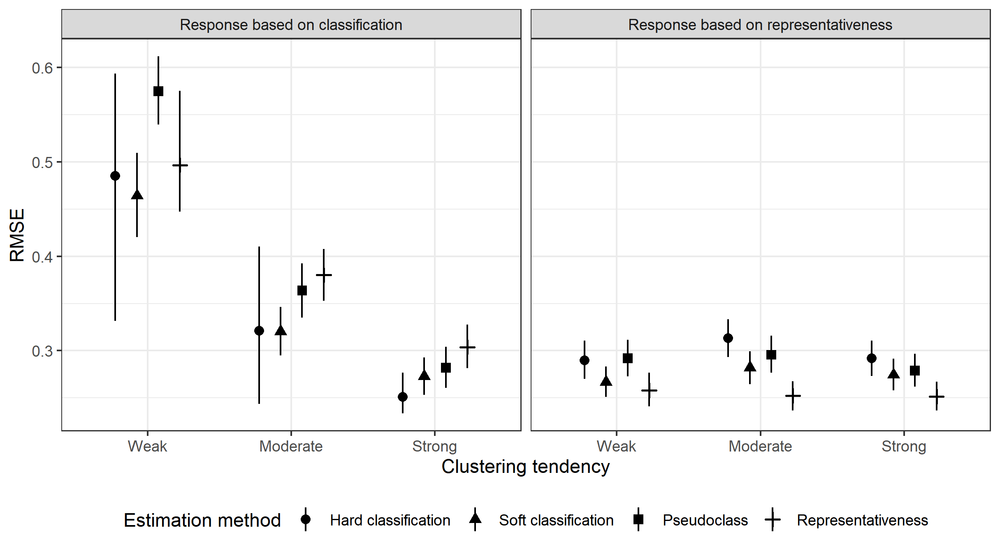
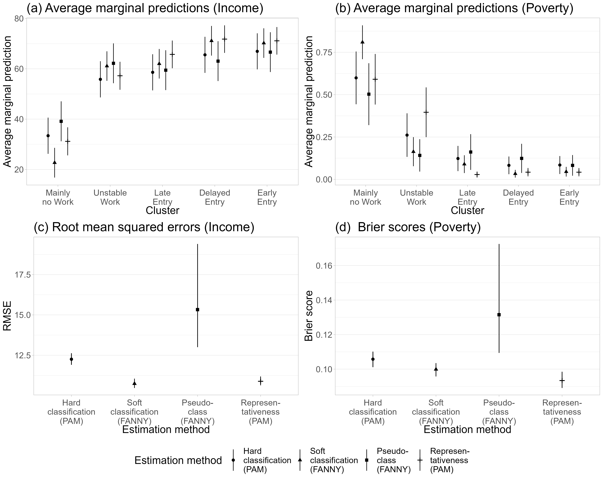

## From sequences to variables - rethinking the relationship of sequences and outcomes

Materials for the paper *From sequences to variables - rethinking the relationship of sequences and outcomes* by Satu Helske, Jouni Helske and Guilherme Chihaya.

Sequence analysis (SA) has gained increasing interest in social sciences for the holistic analysis of life course and other longitudinal data. The usual approach is to construct sequences, calculate dissimilarities, group similar sequences with cluster analysis, and use cluster membership as a dependent or independent variable in a regression model.

This approach may be problematic as cluster memberships are assumed to be fixed known characteristics of the subjects in subsequent analyses. Furthermore, often it is more reasonable to assume that individual sequences are mixtures of multiple ideal types rather than equal members of some group. Failing to account for uncertain and mixed memberships may lead to wrong conclusions about the nature of the studied relationships.

In this paper, we bring forward and discuss the problems of the "traditional" use of SA clusters as variables and compare four approaches for creating explanatory variables from sequence dissimilarities using different types of data. We conduct simulation and empirical studies, demonstrating the importance of considering how sequences and outcomes are related and the need to adjust analyses accordingly. In many typical social science applications, the traditional approach is prone to result in wrong conclusions and so-called similarity-based approaches such as representativeness should be preferred.

* SocArXiv preprint: https://osf.io/preprints/socarxiv/srxag/

### Repository contents

* `simulation_experiment`: Codes, figures, and data used in simulation experiment
* `empirical_analysis`: Codes and figures for the empirical analysis

### Empirical data

The empirical analyses in the article were conducted using R in the MONA remote access system of Statistics Sweden. The dataset comprises a sample of all residents of Sweden who turned 18 years old in 1997 and who lived continuously in the country until 2017 (*N* = 10,000). In other words, we observe all subjects from age 18 to age 38. Yearly states are coded as "Working" and "Not working" based on income and employment information from the Longitudinal Integrated Database for Health Insurance and Labour Market Studies (LISA). Other variables included in the multivariate analysis are retrieved from the Total Population Register (RTB). 

We were interested in two outcome variables: (1) the probability of being in the lowest income quintile at the end of the sequence (a measure of poverty) and (2) the square root of cumulative income over the entire sequence (in 1000 SEK). Income in this case was income from wages, business, and other economic activity, including social benefits related to economic activity (such as parental leave and sick leave compensations). We also had measurements of characteristics of the individual and of their family background at the start of the sequence. These were: region of residence (Metropolitan areas, smaller cities, countryside), mother's education, fathers' education, mother's employment status, father's employment status, and sex. 

### Output examples

Illustration of four data types based on the strength of the clustering tendency and the type of the sequence--outcome link. The shade of the points refer to the value of a continuous outcome. In panels A and B the value of the outcome depends on the class membership (classes differentiated by shape) and the within-class variation is random, while in panels C and D the value of the outcome increases along the vertical axis. The dashed lines show a partitioning suggested by a PAM clustering algorithm.

Clusters of sequences simulated from three types of mixture Markov models with varying clustering tendencies (weak, reasonable, and strong). The colours refer to four simulated states.

Average root mean square errors of predictions from 10,000 simulations with 95\% percentile intervals.

Average marginal predictions, root mean squared errors, and Brier scores by estimation method and outcome.

### Additional analysis

Here we show the RMSE for each method for sample sizes of 1000 and 200 using several alternative methods:

Posterior mean and 95% posterior intervals for the RMSE with sample size 1000.

Posterior mean and 95% posterior intervals for the RMSE with sample size 200.

The gravity center and reprsentativeness perform relatively similar, both in terms of estimation method and data generation. Data generation based on PAM and FANNY hard classification are very similar, but these estimation methods perform somewhat differently in terms of resulting RMSE.

When the response variable is simulated from the standard normal distribution without any connection to the covariates, all methods perform equally poorly, as expected:

Average and 95% quantiles of RMSE based on different sequences with no connection to response.

Yet another alternative, instead of computing RMSE, use BIC as measure of goodness, showing similar patterns as the RMSE case (but less interpretable):

Posterior mean and 95% quantiles of BIC values.

